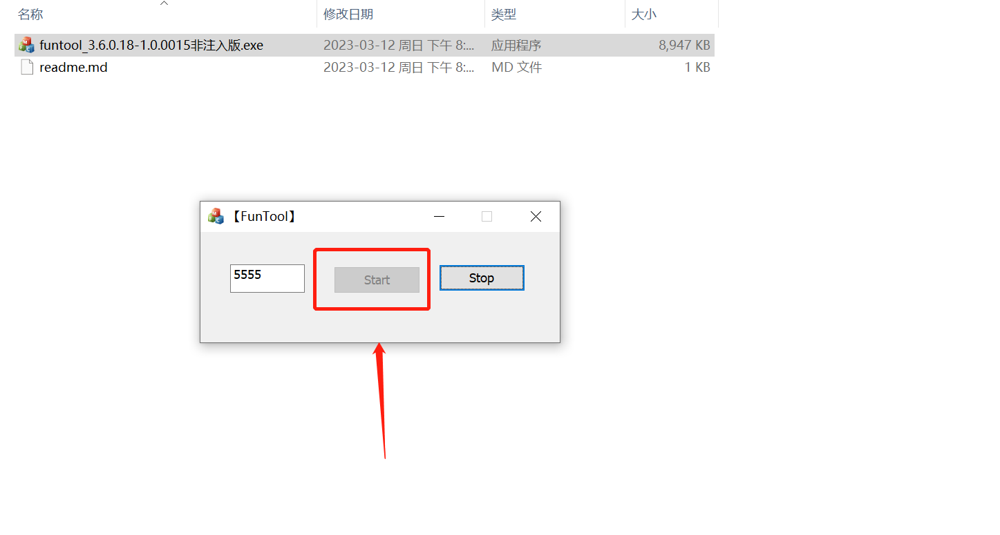

#### [号卡中心-专注优质号卡套餐服务](https://hk.bjjii.com/?p=ookk)
<a href="https://hk.bjjii.com/?p=ookk">
</a>


# Wechat Bot

一个 基于 OpenAI + Wechat 智能回复、支持上下文回复的微信机器人,可以用来帮助你自动回复微信消息。

### 准备

#### 本地部署

> 仅支持window系统

1. 安装`Git`和`nodejs`

2. 支持的微信版本下载 [WeChatSetup3.6.0.18.exe](https://ghproxy.com/https://github.com/tom-snow/wechat-windows-versions/releases/download/v3.6.0.18/WeChatSetup-3.6.0.18.exe) 并安装、登录。

3. 下载 [funtool_3.6.0.18-1.0.0015非注入版.exe](https://ghproxy.com/https://raw.githubusercontent.com/x-dr/wechat-bot/main/funtool/funtool_3.6.0.18-1.0.0015非注入版.exe) 并运行 。




4. 安装`pm2`方便进程守护

```shell
npm install pm2 -g
```

5. 拉取项目并修改`.env` 文件

```shell
git clone https://github.com/x-dr/wechat-bot.git

#国内加速clone
#git clone https://ghproxy.com/https://github.com/x-dr/wechat-bot.git

```

> 修改`.env` 文件

```shell

# openai的key，需要自己去获取 ，地址：https://beta.openai.com/account/api-keys
OPENAI_API_KEY ='sk-xxxxxxxxxxxxxxx'

# 反代的api,为空时为默认值 https://api.openai.com 
PROXY_API = 'https://openai.1rmb.tk/v1'

# # OpenAI API Model - https://platform.openai.com/docs/models
OPENAI_API_MODEL= 'gpt-3.5-turbo-16k'

#运行微信服务的ip+端口
SERVER_HOST = '127.0.0.1:5555'

#星火认知大模型
#服务接口认证信息
#获取地址https://console.xfyun.cn/services/bm3
#APIKey
sparkAPIKey = 'xxxxxxxxxxxxx'
#APISecret
sparkAPISecret = 'xxxxxxxxxxxxxx'
#APPID
sparkAPPID = 'xxxxxxxxxxxxxx'
#UID任意填写
sparkUID = 'wx'


```

6. 运行

```shell

npm i
pm2 start pm2.json

```

#### 使用Docker部署

+ 拉取镜像

```shell
docker pull gindex/wechat-box:latest
```

+ 运行

```shell
docker run -itd  --name wechat-service  \
    -e TARGET_AUTO_RESTART="yes" \
    -e TARGET_WECHAT_BOT="yes" \
    -e UPDATE_WECHAT_BOT="yes" \
    -e OPENAI_API_KEY="sk-xxxxxxxxxxxx" \
    -e PROXY_API="https://openai.1rmb.tk/v1" \
    -e SERVER_HOST='127.0.0.1:5555' \
    -e TARGET_CMD=wechat-start \
    -e VNC_PASSWORD=password \
    -p 8080:8080 -p 5555:5555 -p 5900:5900 \
    --add-host=dldir1.qq.com:127.0.0.1 \
    gindex/wechat-box:latest

```
+ 登录微信
打开`http://your-ip:8080/vnc.html`,登录微信并启动hook软件（参考本地部署）

+ 运行bot

```shell
docker exec -it wechat-service bash
```

```shell
startbot
```


#### 环境变量

| Env | Default | Example | Description |
| - | - | - | - |
| `TARGET_AUTO_RESTART` | no | `yes` | TARGET_LOG_FILE |
| `TARGET_WECHAT_BOT` | no | `yes` | 是否启用微信机器人 |
| `UPDATE_WECHAT_BOT` | no | `yes` | 是否自动更新微信机器人 |
| `OPENAI_API_KEY` | `null` | `sk-xxxx` | OPENAI_API_KEY |
| `PROXY_API` | `https://api.openai.com/v1` | `https://openai.1rmb.tk/v1` | 反代接口地址 |
| `SERVER_HOST` | `null` | `127.0.0.1:5555` | Clients IP address range. |
| `TARGET_CMD` | `null` | `wechat-start` | 重启时执行的命令 |
| `VNC_PASSWORD` | `password` | `bot` | 访问VNC密码 |


### 使用

+ 智能回复
```
/c xxxx   #对话 chatgpt

/s xxx    #对话 星火认知大模型

/c 结束对话  #结束本轮对话

```


> 机器人体验


### 感谢

[@cixingguangming55555](https://github.com/cixingguangming55555/wechat-bot)


